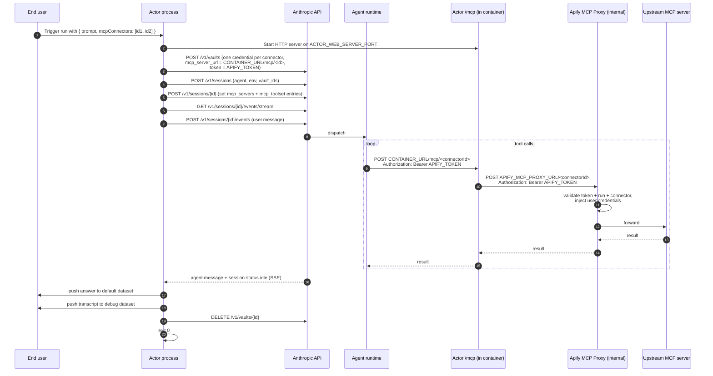

# Plan: thin Actor wrapper for a Claude Managed Agent

**For:** Apify developers who already have a working Claude Managed Agent
and want to ship it as a marketplace Actor.

## What we're building

A minimal Apify Actor template. End user opens the Actor in Apify Console,
types a prompt, picks one or more MCP connectors from a dropdown, runs it,
and reads the answer in the dataset.

The Actor forwards the prompt to a pre-existing Claude Managed Agent on
Anthropic's side, attaches the user-picked connectors as the agent's MCP
toolbox, streams the answer back, and exits. The Apify MCP Proxy is reachable
only from inside the Apify cluster, so the Actor hosts a small public MCP
endpoint that Anthropic's agent calls, and the Actor forwards each request
to the proxy.

## Glossary

- **Claude Managed Agent** — Anthropic's hosted agent runtime. Each
  invocation is a **session**.
- **MCP connector** — user-authorized credentials to a third-party MCP
  server (Slack, Notion, …), stored in their Apify account. ID like
  `conn_abc123`.
- **Apify MCP Proxy** — Apify's internal service at `APIFY_MCP_PROXY_URL`
  (cluster-private). Routes per connector via `/<connectorId>` and injects
  the stored credentials before forwarding upstream.
- **vault** (Anthropic) — per-session bag of credentials matched to MCP
  servers by URL.
- **Apify run token** — `APIFY_TOKEN`, run-scoped, expires with the run.
  The bearer the agent sends to the Actor's `/mcp` and that the Actor
  sends to the internal proxy.

## Lifecycle (per run)



## Step-by-step

### One-time setup (developer)

| # | Action |
|---|---|
| 0a | Create the Managed Agent on Anthropic side (system prompt, model, skills). **`mcp_servers` must be empty** — the Actor injects them per session. |
| 0b | Create one cloud Environment (`POST /v1/environments`). |
| 0c | Set Actor secrets: `ANTHROPIC_API_KEY`, `ANTHROPIC_AGENT_ID`, `ANTHROPIC_ENVIRONMENT_ID`. |
| 0d | `apify push`. |

A small `scripts/provision.ts` CLI helps with 0a + 0b: reads
`ANTHROPIC_API_KEY` from env, prompts for agent name + system prompt,
creates agent + environment, prints the two IDs to paste into Apify
secrets. The Actor runtime never calls `/v1/agents` or `/v1/environments`.

### Per run (the Actor process)

| # | Action | API / SDK |
|---|---|---|
| 1 | Read `Actor.getInput()` → `{ prompt, mcpConnectors: string[] }`. | Apify SDK |
| 2 | Read `APIFY_MCP_PROXY_URL`, `APIFY_CONTAINER_URL`, `APIFY_TOKEN`, `ACTOR_WEB_SERVER_PORT`, and the run deadline. | env |
| 3 | Start the local `/mcp/<connectorId>` server (existing `src/server.ts` + `src/mcp.ts`). Listens on `ACTOR_WEB_SERVER_PORT`, forwards each MCP request to `${APIFY_MCP_PROXY_URL}/<connectorId>` with `Authorization: Bearer ${APIFY_TOKEN}`. | Node `http` + `@modelcontextprotocol/sdk` |
| 4 | Create a vault. | `POST /v1/vaults` |
| 5 | For each `connectorId`, add a `static_bearer` credential: `mcp_server_url = ${APIFY_CONTAINER_URL}/mcp/${connectorId}`, `token = ${APIFY_TOKEN}`. | `POST /v1/vaults/{id}/credentials` |
| 6 | Create the session, pass `vault_ids = [vault.id]`. Status starts `idle`. | `POST /v1/sessions` |
| 7 | **If `mcpConnectors` is non-empty:** `GET` the session, replace `agent.mcp_servers` entirely with our container URLs, replace only `mcp_toolset` entries in `agent.tools` with ours (preserve everything else verbatim), `POST` back. Our `mcp_toolset` entries use `permission_policy: always_allow`. **If empty:** skip. | `GET` + `POST /v1/sessions/{id}` |
| 8 | Open SSE stream **before** sending the prompt. Collect events into a transcript. | `GET /v1/sessions/{id}/events/stream` |
| 9 | Send `user.message` event with the prompt. | `POST /v1/sessions/{id}/events` |
| 10 | Consume stream until `session.status.idle` or `terminated`, bounded by the agent deadline. | SSE consumer |
| 11 | Extract text from the most recent `agent.message` event. | (in-stream) |
| 12 | Push final answer to default dataset; push one row per event to `debug` dataset. | `Actor.pushData` / `Actor.openDataset('debug')` |
| 13 | Stop the local `/mcp` server. Delete the vault (best-effort, in `finally`). | local + `DELETE /v1/vaults/{id}` |
| 14 | `process.exit(0)` (or non-zero on failure). | — |

## Input schema

```jsonc
{
  "prompt": {
    "title": "Prompt",
    "type": "string",
    "editor": "textarea"
  },
  "mcpConnectors": {
    "title": "MCP connectors",
    "type": "array",
    "resourceType": "mcpConnector",
    "mcpServers": [{ "url": "*" }],
    "default": []
  }
}
```

`mcpServers: [{ url: "*" }]` accepts any user connector; a more
restrictive Actor (e.g. Slack-only) can narrow this. If `mcpConnectors`
is empty the agent runs with only its built-in tools.

## Output

**default** — one row per run:

```jsonc
{ "prompt": "...", "answer": "...", "sessionId": "ses_...",
  "error": null, "partial": false }
```

`error` is `null` on success or a short code on failure (`"timeout"`,
`"session_terminated"`, `"stream_dropped"`, `"setup_failed"`). `partial`
is `true` if `answer` was extracted from a partial event.

**debug** — one row per SSE event (`agent.thinking`, `agent.tool_use`,
`agent.mcp_tool_use`, `agent.message`, status changes, …):

```jsonc
{ "type": "agent.tool_use", "createdAt": "2026-05-28T...", "payload": { ... } }
```

## Failure handling

**Where it can fail.** *Setup* (vault create, credential add, session
create/update, sending `user.message`) — typically auth or network.
*Stream* (SSE drops, session reaches `terminated`, hard deadline hit).
*Local /mcp serving* (the SDK transport throws; handled per-request and
surfaced as JSON-RPC errors to the agent — does not abort the run).
*Cleanup* (vault delete) — non-fatal, logged.

**What we do.** Main flow in `try` / `finally`; `finally` stops the local
server and attempts vault deletion. On any fatal failure: push collected
events to `debug`, push one row to default with `error` set and `answer`
set to the last `agent.message` text (with `partial: true`) if any, exit
non-zero.

**Agent deadline = Actor deadline − ~30s.** We read the Actor's run
deadline from the runtime env and subtract a small offset to reserve
cleanup time. If the agent hasn't reached `idle` by then, the stream
consumer stops with `error: "timeout"`.

SSE reconnect, 429 retry, and resumable runs are out of scope for v1.

## Gotchas

- **`mcp_server_url` must byte-match** between the vault credential and
  the session's `mcp_servers` entry. Construct both from the same template
  string (`${APIFY_CONTAINER_URL}/mcp/${connectorId}`).
- **The local `/mcp` server must be listening** before we create vault
  credentials referencing its URL — otherwise the first agent tool call
  arrives at a closed port. Start it in step 3.
- **Permission policy on injected mcp_toolsets is `always_allow`** —
  Actor runs are unattended; no human to answer `always_ask`.
- **Anthropic environment networking.** Default `unrestricted` works.
  With `limited`, the developer needs `*.runs.apify.net` in
  `allowed_hosts`.
- **Apify MCP Proxy is V1.** Most major OAuth providers (GitHub, Slack,
  Google, Microsoft) currently need "user-provided OAuth client" setup;
  Notion + a few others work with zero setup via DCR. Worth a README note
  for forkers.

## Alternatives considered

**A. Anthropic agent calls the Apify MCP Proxy directly.** Conceptually
clean — Actor drops out of the request path. Rejected because the proxy
is currently cluster-private (`APIFY_MCP_PROXY_URL` resolves to a
non-routable internal address); external callers cannot reach it. If this
ever changes, the migration from v1 is a one-line URL swap in step 5
and step 7.

**B. MCP Tunnel (Anthropic research preview).** Anthropic-operated
cloudflared tunnel that exposes private MCP servers to Anthropic agents
without public ingress. Would also let the Actor drop out of the request
path. Rejected for v1 because it's research preview, Anthropic-specific,
and requires deploying cloudflared + Anthropic's proxy component as
platform infrastructure.

**C. Per-run agent cloning** (current code). Clone the template agent
each run with a run-specific MCP URL. Rejected: extra API calls, orphaned
agents on crashes, and the session-update endpoint already supports
per-session `mcp_servers` override.

**D. Standby mode** (Actor as long-running web server with a stable
URL). Couples the agent definition to a specific Actor slug. Cold-start
latency is moot anyway (agent runs take seconds-to-minutes).

**E. Merge developer-side MCP servers with ours.** Append user connectors
instead of replacing. Rejected: the per-session vault carries credentials
only for Apify connectors; developer-side servers would call out
unauthenticated and fail.

## Out of scope for v1

**Agent writing back to Apify storage** (datasets, KV stores, run
metadata). If/when these tools land as MCP tools that the agent can call,
they're picked up automatically through the connector flow — no template
change needed. Running an MCP server inside the Actor *purely to provide
these tools* is rejected; the Actor's `/mcp` is already there only as a
bridge to the internal proxy, not as a host for new tools.

## Sources

- Managed Agents — https://platform.claude.com/docs/en/managed-agents/overview
- Sessions — https://platform.claude.com/docs/en/managed-agents/sessions
- Events / SSE — https://platform.claude.com/docs/en/managed-agents/events-and-streaming
- Vaults — https://platform.claude.com/docs/en/managed-agents/vaults
- Environments — https://platform.claude.com/docs/en/managed-agents/environments
- MCP Tunnels (preview) — https://platform.claude.com/docs/en/agents-and-tools/mcp-tunnels
- Apify MCP Proxy routing — `apify/apify-mcp-proxy` `src/server.ts`
- Apify MCP Proxy deploy config (cluster-private) — `apify/apify-mcp-proxy` `deploy/helm/values.yaml.gotmpl`
- Existing Actor `/mcp` implementation — `src/server.ts` + `src/mcp.ts` on this branch
