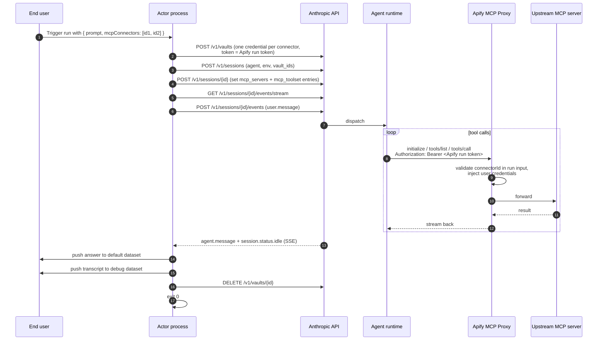

# Plan: thin Actor wrapper for a Claude Managed Agent

**For:** Apify developers who already have a working Claude Managed Agent
and want to ship it as a marketplace Actor.

## What we're building

A minimal Apify Actor template. End user opens the Actor in Apify Console,
types a prompt, picks one or more MCP connectors from a dropdown, runs it,
and reads the answer in the dataset.

The Actor forwards the prompt to the pre-existing Claude Managed Agent on
Anthropic's side, attaches the user-picked connectors as the agent's MCP
toolbox, streams the answer back, and exits. The agent talks to the Apify
MCP Proxy directly — the Actor is **not** in the request path for tool
calls.

Target: ~120 LOC. Fork + push should take ~5 minutes.

## Glossary

- **Claude Managed Agent** — Anthropic's hosted agent runtime. Developer
  defines it once (system prompt, model, tools, MCP servers); the
  Anthropic API spins up containers and runs the agent loop. Each
  invocation is a **session**.
- **MCP connector** — pre-authorized credentials to a third-party MCP
  server (Slack, Notion, GitHub, …), stored in the end user's Apify
  account. Created once via Apify Console → Settings → Integrations.
  Each connector has an ID like `conn_abc123`.
- **Apify MCP Proxy** — multi-tenant Apify service at `APIFY_MCP_PROXY_URL`.
  Routes per connector via `/connection/<connectorId>` and injects the
  connector's stored credentials before forwarding upstream.
- **vault** (Anthropic concept) — a per-session bag of credentials, each
  bound to a specific MCP server URL. Anthropic matches by URL and
  injects the credential into the agent's outbound MCP calls.
- **Apify run token** — the run-scoped Apify API token exposed inside the
  Actor container as `ACTOR_RUN_API_TOKEN`. Expires when the run ends.
  This is the token we hand to Anthropic via the vault. Anthropic's
  credential type for it is `static_bearer`.

## Lifecycle (per run)



## Step-by-step

### One-time setup (developer)

| # | Action |
|---|---|
| 0a | Create the Managed Agent on Anthropic side (system prompt, model, skills). **`mcp_servers` must be empty** — the Actor injects them per session. |
| 0b | Create one cloud Environment (`POST /v1/environments`). |
| 0c | Set Actor secrets: `ANTHROPIC_API_KEY`, `ANTHROPIC_AGENT_ID`, `ANTHROPIC_ENVIRONMENT_ID`. |
| 0d | `apify push`. |

A small `scripts/provision.ts` CLI helps with 0a + 0b: reads
`ANTHROPIC_API_KEY` from env, prompts for agent name + system prompt,
creates agent + environment, prints the two IDs to paste into Apify
secrets. The Actor runtime never calls `/v1/agents` or `/v1/environments`.

### Per run (the Actor process)

| # | Action | API / SDK |
|---|---|---|
| 1 | Read `Actor.getInput()` → `{ prompt, mcpConnectors: string[] }`. | Apify SDK |
| 2 | Read `process.env.APIFY_MCP_PROXY_URL`, `ACTOR_RUN_API_TOKEN`, and `ACTOR_TIMEOUT_AT`. | Apify runtime env |
| 3 | Create a vault. | `POST /v1/vaults` |
| 4 | For each `connectorId`, add a `static_bearer` credential: `mcp_server_url = ${APIFY_MCP_PROXY_URL}/connection/${connectorId}`, `token = <Apify run token>`. | `POST /v1/vaults/{id}/credentials` |
| 5 | Create the session, pass `vault_ids = [vault.id]`. Status starts `idle`. | `POST /v1/sessions` |
| 6 | **If `mcpConnectors` is non-empty:** `GET` the session, replace `agent.mcp_servers` entirely with our proxy URLs, replace only `mcp_toolset` entries in `agent.tools` with ours (preserve `agent_toolset_20260401`, skills, custom configs verbatim), `POST` back. Our `mcp_toolset` entries use `permission_policy: always_allow`. **If empty:** skip. | `GET` + `POST /v1/sessions/{id}` |
| 7 | Open SSE stream **before** sending the prompt. Collect events into a transcript. | `GET /v1/sessions/{id}/events/stream` |
| 8 | Send `user.message` event with the prompt. | `POST /v1/sessions/{id}/events` |
| 9 | Consume stream until `session.status.idle` or `terminated`, bounded by the agent deadline. | SSE consumer |
| 10 | Extract text from the most recent `agent.message` event. | (in-stream) |
| 11 | Push final answer to default dataset; push one row per event to `debug` dataset. | `Actor.pushData` / `Actor.openDataset('debug')` |
| 12 | Delete the vault (best-effort, in `finally`). | `DELETE /v1/vaults/{id}` |
| 13 | `process.exit(0)` (or non-zero on failure). | — |

## Input schema

```jsonc
{
  "prompt": {
    "title": "Prompt",
    "type": "string",
    "editor": "textarea"
  },
  "mcpConnectors": {
    "title": "MCP connectors",
    "type": "array",
    "resourceType": "mcpConnector",
    "mcpServers": [{ "url": "*" }],
    "default": []
  }
}
```

`mcpServers: [{ url: "*" }]` accepts any user connector; a more
restrictive Actor (e.g. Slack-only) can narrow this. If `mcpConnectors`
is empty the agent runs with only its built-in tools.

## Output

**default** — one row per run:

```jsonc
{ "prompt": "...", "answer": "...", "sessionId": "ses_...",
  "error": null, "partial": false }
```

`error` is `null` on success or a short code on failure (`"timeout"`,
`"session_terminated"`, `"stream_dropped"`, `"setup_failed"`). `partial`
is `true` if `answer` was extracted from a partial event.

**debug** — one row per SSE event (`agent.thinking`, `agent.tool_use`,
`agent.mcp_tool_use`, `agent.message`, status changes, …):

```jsonc
{ "type": "agent.tool_use", "createdAt": "2026-05-28T...", "payload": { ... } }
```

## Failure handling

**Where it can fail.** *Setup* (vault create, credential add, session
create/update, sending `user.message`) — typically auth or network.
*Stream* (SSE drops, session reaches `terminated`, hard deadline hit).
*Cleanup* (vault delete) — non-fatal, logged.

**What we do.** Main flow in `try` / `finally`; `finally` always attempts
vault deletion. On any fatal failure: push collected events to `debug`,
push one row to default with `error` set and `answer` set to the last
`agent.message` text (with `partial: true`) if any, exit non-zero.

**Agent deadline = Actor deadline − ~30s.** We read the Actor's run
deadline from `ACTOR_TIMEOUT_AT` and subtract a small offset to reserve
cleanup time. If the agent hasn't reached `idle` by then, the stream
consumer stops with `error: "timeout"`.

SSE reconnect, 429 retry, and resumable runs are out of scope for v1.

## Gotchas

- **`mcp_server_url` must byte-match** between the vault credential (step
  4) and the session's `mcp_servers` entry (step 6). Construct both from
  the same template string.
- **Permission policy on our injected mcp_toolsets is `always_allow`** —
  forced by the deployment model (Actor runs are unattended; no human to
  answer `always_ask`).
- **Anthropic environment networking.** Default `unrestricted` works.
  With `limited`, the developer needs the Apify MCP Proxy host in
  `allowed_hosts`.
- **MCP Proxy is V1.** Most major OAuth providers (GitHub, Slack, Google,
  Microsoft) currently need "user-provided OAuth client" setup; Notion +
  a few others work with zero setup via DCR. Worth a README section so
  forkers know which connectors are easy/hard to wire up.

## Alternatives considered

**A. Actor as MCP host (`/mcp` proxy inside the container).** Anthropic's
agent calls `<container-url>/mcp/<id>`; Actor forwards to the proxy.
Rejected: the Apify MCP Proxy already does credential injection, tool
filtering, run-scoped validation, and session cleanup; putting the Actor
in front duplicates checks and adds a hop. Easy to add later as opt-in.

**E. Merge developer-side MCP servers with ours.** Append user connectors
instead of replacing. Rejected: our per-session vault carries credentials
only for Apify connectors; developer-side servers would call out
unauthenticated and fail. Simpler contract is "agent has no MCP, Actor
owns it."

Also rejected: **B. Standby mode** (couples agent to a specific Actor
slug, cold-start latency is moot anyway); **C. Per-run agent cloning**
(extra API calls, orphaned agents on crashes); **D. Bootstrap-on-first-run**
(race conditions, hidden side effects).

## Out of scope for v1

**Agent writing back to Apify storage** (datasets, KV stores, run
metadata). Preferred future path: Apify adds run-scoped write tools
(`push_to_dataset`, `set_kv_value`, `set_status_message`) to
`mcp.apify.com` — this template picks them up automatically, no template
change needed. We deliberately rejected running an MCP server inside the
Actor to provide these tools.

## Sources

- Managed Agents — https://platform.claude.com/docs/en/managed-agents/overview
- Sessions — https://platform.claude.com/docs/en/managed-agents/sessions
- Events / SSE — https://platform.claude.com/docs/en/managed-agents/events-and-streaming
- Vaults — https://platform.claude.com/docs/en/managed-agents/vaults
- Environments — https://platform.claude.com/docs/en/managed-agents/environments
- Apify MCP Connectors (user-facing draft) — provided in conversation
- Apify MCP Proxy spec — `apify/apify-mcp-proxy` `docs/mcp-proxy-and-connections.md`
- Apify MCP Proxy deploy config — `apify/apify-mcp-proxy` `deploy/helm/values.yaml.gotmpl`
