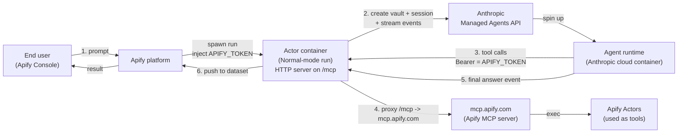
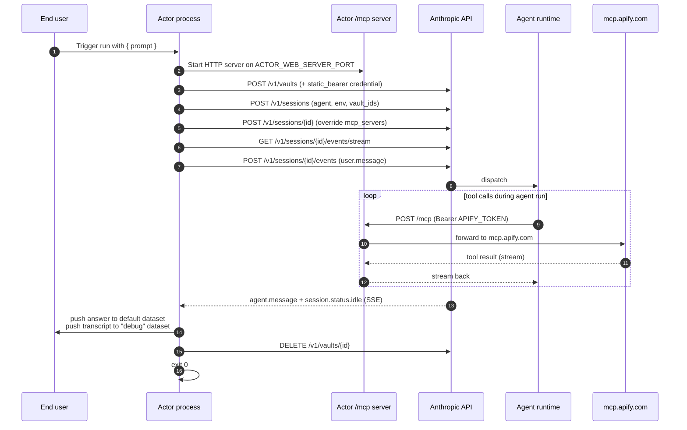

# Plan: thin Actor wrapper for a Claude Managed Agent

## What we're building

A minimal Apify Actor template that lets a developer publish their existing
Claude Managed Agent to the Apify marketplace.

The Actor does two things, nothing else:

1. **Forwards a prompt** from the Apify end user to a pre-existing Managed Agent
   on Anthropic's side and returns the answer.
2. **Exposes the Apify MCP server** as the agent's toolbox, so the agent can
   call any Apify Actor as a tool, using the run-scoped Apify token.

Target size: under 300 LOC. Forking + publishing should take a developer ~5
minutes.

## Architecture



## Lifecycle (per run)



## Step-by-step (with sources)

### One-time setup (developer)

| # | Action | How |
|---|---|---|
| 0a | Create the Managed Agent on Anthropic's side (system prompt, model, skills). `mcp_servers` can be empty. | Anthropic Console or `scripts/provision.ts` |
| 0b | Create one cloud Environment. | `POST /v1/environments` |
| 0c | Set Actor secrets in Apify: `ANTHROPIC_API_KEY`, `ANTHROPIC_AGENT_ID`, `ANTHROPIC_ENVIRONMENT_ID`. | Apify Console |
| 0d | `apify push`. | Apify CLI |

### Per run (the Actor process)

| # | Action | API / SDK |
|---|---|---|
| 1 | Read `Actor.getInput()` → `{ prompt }`. | Apify SDK |
| 2 | Start HTTP server on `process.env.ACTOR_WEB_SERVER_PORT`, route `ALL /mcp`. URL is `<ACTOR_WEB_SERVER_URL>/mcp`. | Node `http` |
| 3 | Create vault. | `POST /v1/vaults` |
| 4 | Add `static_bearer` credential: `mcp_server_url = <ACTOR_WEB_SERVER_URL>/mcp`, `token = APIFY_TOKEN`. | `POST /v1/vaults/{id}/credentials` |
| 5 | Create session, pass `vault_ids = [<vault.id>]`. Status starts `idle`. | `POST /v1/sessions` |
| 6 | Update session: `agent.mcp_servers = [{ type: "url", name: "apify", url: "<ACTOR_WEB_SERVER_URL>/mcp" }]`, `agent.tools` adds `mcp_toolset` for `"apify"`. Updates are session-local. | `POST /v1/sessions/{id}` |
| 7 | Open SSE stream **before** sending the prompt (avoids dropped events). Collect events into an in-memory transcript as they arrive. | `GET /v1/sessions/{id}/events/stream` |
| 8 | Send `user.message` event with the prompt. | `POST /v1/sessions/{id}/events` |
| 9 | Consume stream until `session.status.idle` or `terminated`. | SSE consumer |
| 10 | Extract text from the most recent `agent.message` event. | (in-stream) |
| 11 | `Actor.pushData({ prompt, answer, sessionId })` → default dataset. Open `Actor.openDataset('debug')` and push the full transcript (all events) → debug dataset. | Apify SDK |
| 12 | Delete the vault. | `DELETE /v1/vaults/{id}` |
| 13 | `process.exit(0)`. | — |

### `/mcp` handler (lives inside the Actor)

| # | Action | Notes |
|---|---|---|
| a | Receive request from Anthropic agent runtime. `Authorization: Bearer APIFY_TOKEN` is injected by vault credential. | URL is "secret hard-to-guess", but the bearer adds defence-in-depth. |
| b | Forward to `https://mcp.apify.com/mcp` (pass through method, body, headers). | Stateless reverse proxy. |
| c | Stream response back. Apify MCP supports streamable HTTP. | — |

## Confirmed decisions

- **`/mcp` path:** mounted at `<ACTOR_WEB_SERVER_URL>/mcp`, not root. Leaves
  room for other routes (health check, debug) without ambiguity.
- **Input schema:** `{ prompt: string }` only. No `additional_instructions`
  field for v1.
- **Output:** two datasets.
  - **default dataset** — one row per run: `{ prompt, answer, sessionId }`.
  - **`debug` dataset** — one row per event observed during the run (tool
    calls, thinking, agent.message, status changes). Useful for forkers
    debugging their agent's behaviour without re-running. Cost: ~5 extra
    LOC (`const debug = await Actor.openDataset('debug'); debug.pushData(ev)`
    in the SSE loop).

## File layout

```
src/
  main.ts          ~120 LOC   input -> server -> vault -> session -> stream -> dataset
  mcp-proxy.ts     ~40  LOC   /mcp -> mcp.apify.com passthrough
  anthropic.ts     ~80  LOC   thin SDK wrappers
scripts/
  provision.ts     ~50  LOC   developer runs once to create agent + environment
.actor/
  actor.json
  input_schema.json   { prompt: { type: "string", editor: "textarea" } }
README.md          fork-and-push guide
```

## Important things to know

- **Run mode is Normal, not Standby.** Each Actor run is a fresh container with
  a unique URL (`https://<container-key>.runs.apify.net`) exposed as
  `ACTOR_WEB_SERVER_URL`. The container exits when the agent run finishes.
- **The Actor never creates or modifies the agent.** Agent is provisioned by
  the developer up front. The Actor only touches vaults, sessions, events.
- **Per-session MCP override is the key trick.** The agent's `mcp_servers` is
  replaced on the freshly-created session (which starts `idle`) with the
  run-specific URL before we send the first message.
- **Auth flows transparently.** `APIFY_TOKEN` is run-scoped — it can only
  access this run's resources. It travels: Apify run env → vault credential →
  Anthropic injects into outgoing MCP calls → our `/mcp` proxies it to
  `mcp.apify.com`. The end user pays for their own runs.
- **Streaming, not polling.** SDK uses SSE (`GET /events/stream`). The existing
  4 s polling loop is removed.
- **Networking requirements on the Anthropic environment:** default
  `unrestricted` works. With `limited`, the developer needs
  `*.runs.apify.net` + `mcp.apify.com` in `allowed_hosts`.

## What gets deleted from the current code

- `src/server.ts` (session-tracking in-Actor HTTP gateway) — replaced by a much
  simpler `/mcp` reverse proxy.
- `cloneAgentWithDynamicMcp` in `src/anthropic.ts` — agent cloning is gone.
- `waitForSessionIdle` polling loop — replaced by SSE.
- The KV-store environment cache — environment ID is now a static secret.
- `error` status check at `src/anthropic.ts:289` — that status doesn't exist;
  correct values are `idle | running | rescheduling | terminated`.

## Alternatives considered

### A. Standby mode (Actor as long-running web server)

**How:** Actor stays alive at a stable URL like `https://<slug>.apify.actor`.
Agent's `mcp_servers` is baked in at agent-creation time.

**Why not:** Couples the agent definition to a specific Actor slug. Developers
who already built their agent have to recreate it. Cold-start latency is moot
(agent runs take seconds-to-minutes anyway). Standby's strengths (warm,
multi-turn) don't help this workload. Can be added later as opt-in.

### B. Per-run agent cloning (current code)

**How:** Clone the template agent each run with the run-specific MCP URL.

**Why not:** Extra API calls, orphaned agents on crashes, and the docs
explicitly support per-session `mcp_servers` update — which removes the need to
clone. Simpler is better.

### C. Direct Anthropic → `mcp.apify.com` (skip the Actor in the tool path)

**How:** Put `mcp.apify.com` directly in the agent's `mcp_servers`. The Actor
just launches the session and exits.

**Why not:** Loses the Actor's role as the MCP exposure point. The user
explicitly wants the Actor to expose MCP so it can act as a customisation
seam (filtering, logging) later. Keeping `/mcp` in the Actor costs ~40 LOC
and gives that option.

### D. Bootstrap-on-first-run (auto-provision agent at Actor startup)

**How:** Actor checks if `ANTHROPIC_AGENT_ID` is set; if not, creates the
agent + environment and persists IDs in the KV store.

**Why not:** Race conditions on parallel boots, hidden side effects, complex
runtime. A `scripts/provision.ts` the developer runs locally is clearer for a
template.

## Risks

1. **Anthropic's agent runtime must be able to reach `*.runs.apify.net`.**
   Default unrestricted networking covers it. Document the `allowed_hosts`
   list for developers who use `limited` networking.
2. **`mcp_server_url` must be byte-identical** between the vault credential
   (step 4) and the session's `mcp_servers` entry (step 6). Construct both
   from the same `ACTOR_WEB_SERVER_URL` variable to guarantee.
3. **MCP proxy must handle SSE.** The Apify MCP server uses streamable HTTP.
   We need a proxy that doesn't buffer the full response. Plain `fetch` +
   pipe-through works; we'll smoke-test before publishing.
4. **`ACTOR_WEB_SERVER_PORT` default is 4321.** Make sure the HTTP server
   listens before any Anthropic API call (so by the time the agent tries to
   call `/mcp`, the server is up).

## Sources

- Managed Agents overview — https://platform.claude.com/docs/en/managed-agents/overview
- Sessions (create, update, statuses) — https://platform.claude.com/docs/en/managed-agents/sessions
- Events and streaming (SSE) — https://platform.claude.com/docs/en/managed-agents/events-and-streaming
- Vaults and `static_bearer` — https://platform.claude.com/docs/en/managed-agents/vaults
- Environments — https://platform.claude.com/docs/en/managed-agents/environments
- Apify container web server — https://docs.apify.com/platform/actors/development/programming-interface/container-web-server
- Apify MCP server — https://docs.apify.com/platform/integrations/mcp
