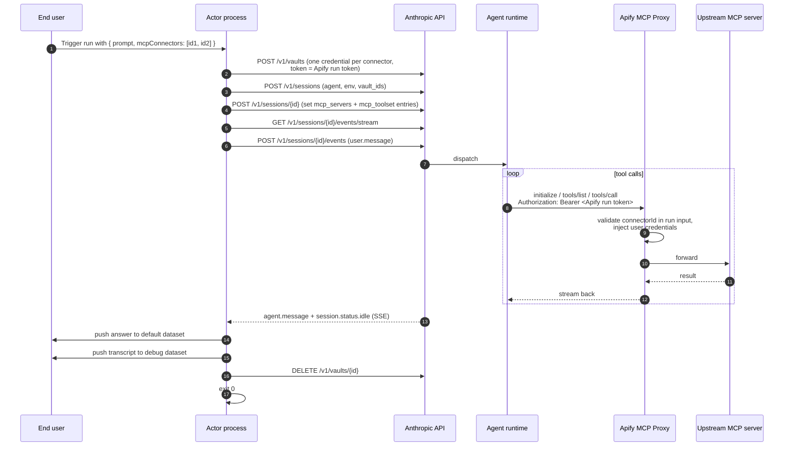

# Plan: thin Actor wrapper for a Claude Managed Agent

## What we're building

A minimal Apify Actor template that lets a developer publish their existing
Claude Managed Agent to the Apify marketplace, with the agent's toolbox wired
to **Apify MCP connectors** — Slack, Notion, GitHub and any other MCP server
the end user has authorized in their Apify account.

The Actor does one thing: it forwards a prompt to the agent and returns the
answer. The agent talks to the Apify MCP Proxy directly — the Actor is **not**
in the request path for tool calls.

Target size: ~120 LOC. Forking + publishing should take ~5 minutes.

## Why this is simple

The Apify MCP Proxy already handles every hard part:
- Stores user credentials encrypted (OAuth, API keys, PATs).
- Injects credentials into upstream MCP requests at runtime.
- Enforces a per-connector tool ceiling and a per-Actor tool ceiling.
- Validates that the calling Actor run is authorized to use each connector.
- Closes sessions automatically when the Actor run ends.

The Actor template just plugs the Anthropic agent into that machinery via
the agent's `mcp_servers`. No HTTP server in the Actor. No `/mcp` proxy code.

## Glossary

- **Claude Managed Agent** — Anthropic's hosted agent runtime. Developer
  defines the agent once (system prompt, model, MCP servers); the Anthropic
  API spins up containers, runs the agent loop, and streams events. Each
  invocation is called a **session**.
- **MCP connector** — a pre-authorized credential to an external MCP server
  (Slack, Notion, GitHub, …), stored in the end user's Apify account.
  Created once via Apify Console → Settings → Integrations. Each connector
  has an ID like `conn_abc123`.
- **Apify MCP Proxy** — multi-tenant Apify service at `APIFY_MCP_PROXY_URL`.
  Routes requests per connector via `/connection/<connectorId>` and injects
  the connector's stored credentials before forwarding upstream.
- **vault** (Anthropic concept) — a per-session bag of credentials, each
  bound to a specific MCP server URL. Anthropic matches by URL and injects
  the credential into the agent's outbound MCP calls.
- **Apify run token** — the run-scoped Apify API token injected into every
  Actor container as `ACTOR_RUN_API_TOKEN`. Expires when the run ends. This
  is the token we hand to Anthropic via the vault; Anthropic's credential
  type for it is `static_bearer`, but the value is always the Apify run
  token.

## Lifecycle (per run)



## Step-by-step (with sources)

### One-time setup (developer)

| # | Action | How |
|---|---|---|
| 0a | Create the Managed Agent on Anthropic side (system prompt, model, skills). **`mcp_servers` must be empty** — the Actor injects them per session; any MCP server you configure on the agent will be ignored (and would fail at runtime anyway, see Important things to know). | Anthropic Console or `scripts/provision.ts` |
| 0b | Create one cloud Environment. | `POST /v1/environments` |
| 0c | Set Actor secrets: `ANTHROPIC_API_KEY`, `ANTHROPIC_AGENT_ID`, `ANTHROPIC_ENVIRONMENT_ID`. | Apify Console |
| 0d | `apify push`. | Apify CLI |

### Per run (the Actor process)

| # | Action | API / SDK |
|---|---|---|
| 1 | Read `Actor.getInput()` → `{ prompt, mcpConnectors: string[] }`. | Apify SDK |
| 2 | Read `process.env.APIFY_MCP_PROXY_URL`, `process.env.ACTOR_RUN_API_TOKEN`, and `process.env.ACTOR_TIMEOUT_AT` (run deadline as ISO timestamp). | Apify runtime env |
| 3 | Create a vault. | `POST /v1/vaults` |
| 4 | For each `connectorId` in input, add a credential of Anthropic type `static_bearer` carrying the Apify run token: `mcp_server_url = ${APIFY_MCP_PROXY_URL}/connection/${connectorId}`, `token = <Apify run token>`. | `POST /v1/vaults/{id}/credentials` |
| 5 | Create the session, pass `vault_ids = [vault.id]`. Status starts `idle`. | `POST /v1/sessions` |
| 6 | **If `mcpConnectors` is non-empty:** `GET /v1/sessions/{id}` to read the agent config inherited at session creation. Build the update by **replacing** `agent.mcp_servers` entirely with our proxy URLs, and **replacing only the `mcp_toolset` entries** in `agent.tools` with ours — everything else in `tools` (notably `agent_toolset_20260401`, skills, custom configs, permission policies) is preserved verbatim. Our `mcp_toolset` entries use `default_config: { permission_policy: { type: "always_allow" } }` because Actor runs are unattended. POST the updated agent block back. **If empty:** skip — the agent runs with its original (necessarily empty) `mcp_servers`. | `GET` + `POST /v1/sessions/{id}` |
| 7 | Open SSE stream **before** sending the prompt (avoids dropped events). Collect events into a transcript as they arrive. | `GET /v1/sessions/{id}/events/stream` |
| 8 | Send `user.message` event with the prompt. | `POST /v1/sessions/{id}/events` |
| 9 | Consume stream until `session.status.idle` or `terminated`, bounded by the agent deadline (see Failure handling). | SSE consumer |
| 10 | Extract text from the most recent `agent.message` event. | (in-stream) |
| 11 | Push final answer to default dataset; push one row per observed event to `debug` dataset. | `Actor.pushData` / `Actor.openDataset('debug')` |
| 12 | Delete the vault (best-effort, runs in `finally`). | `DELETE /v1/vaults/{id}` |
| 13 | `process.exit(0)` (or non-zero on failure — see Failure handling). | — |

There is **no `/mcp` handler** in the Actor. The Anthropic agent talks to the
Apify MCP Proxy directly using the Apify run token that the vault injects.

## Input schema

```jsonc
{
  "prompt": {
    "title": "Prompt",
    "type": "string",
    "editor": "textarea",
    "description": "What you want the agent to do."
  },
  "mcpConnectors": {
    "title": "MCP connectors",
    "type": "array",
    "resourceType": "mcpConnector",
    "mcpServers": [{ "url": "*" }],
    "description": "Connectors the agent can use. Create them in Settings → API & Integrations.",
    "default": []
  }
}
```

`mcpServers: [{ url: "*" }]` keeps the Actor compatible with any user
connector. A more restrictive Actor (e.g. Slack-only) can narrow this.

If `mcpConnectors` is empty at run time, the Actor still runs — the agent
runs without MCP servers and uses only its built-in tools (`agent_toolset`,
skills).

## Output

Two datasets per run.

**default** — one row per run:

```jsonc
{ "prompt": "...", "answer": "...", "sessionId": "ses_...",
  "error": null, "partial": false }
```

On success, `error` is `null` and `partial` is `false`. On failure, `error`
is a short string (`"timeout"`, `"session_terminated"`, `"stream_dropped"`,
`"setup_failed"`, …) and `partial` is `true` if `answer` contains text
extracted from a partial `agent.message` event.

**debug** — one row per event observed on the SSE stream (`agent.thinking`,
`agent.tool_use`, `agent.mcp_tool_use`, `agent.message`, status changes, …):

```jsonc
{ "type": "agent.tool_use", "createdAt": "2026-05-28T...", "payload": { ... } }
```

## File layout

```
src/
  main.ts          ~125 LOC   input -> vault -> session -> stream -> datasets -> exit
                              (includes ~45 LOC of failure handling)
  anthropic.ts     ~60  LOC   thin SDK wrappers (createVault, createSession, updateSession, stream, deleteVault)
scripts/
  provision.ts     ~50  LOC   developer setup (see below)
.actor/
  actor.json
  input_schema.json
README.md           fork-and-push guide
```

### `scripts/provision.ts`

A CLI the developer runs **once on their laptop** before publishing the Actor.

- **Reads** `ANTHROPIC_API_KEY` from the environment.
- **Takes** inline parameters: agent name, system prompt, model.
- **Calls** `POST /v1/agents` and `POST /v1/environments`.
- **Prints** the resulting `ANTHROPIC_AGENT_ID` and `ANTHROPIC_ENVIRONMENT_ID`
  to stdout.
- The developer pastes those values into the Apify Actor secrets (step 0c).

The Actor runtime never calls `/v1/agents` or `/v1/environments`.

## Confirmed decisions

- **Run mode:** Normal (not Standby). One container per run, exits when done.
- **Actor's request-path role:** none. The Anthropic agent talks to the
  Apify MCP Proxy directly. The Actor only orchestrates the Anthropic session.
- **Input shape:** `{ prompt, mcpConnectors }`. No `additional_instructions`
  field for v1. No `timeoutSeconds` field — we read the Actor run's own
  deadline from the runtime env (see Failure handling).
- **Output:** two datasets — default (final answer or error) + `debug` (one
  row per event).
- **Auth token handed to Anthropic:** the Apify run token
  (`ACTOR_RUN_API_TOKEN`). Expires when the run ends.
- **`APIFY_MCP_PROXY_URL` is static.** Verified against
  `apify/apify-mcp-proxy` deploy config: single multi-tenant Kubernetes
  service. The proxy differentiates requests by the Apify run token
  (resolves `runId`/`userId`) and the `/connection/<id>` path. The full URL
  `${APIFY_MCP_PROXY_URL}/connection/<id>` still varies per run because the
  connector ID is per-run input, so we keep the per-session `mcp_servers`
  override in step 6.
- **MCP toolbox is owned by the Actor.** The developer's agent has empty
  `mcp_servers`. Step 6 replaces `mcp_servers` and the `mcp_toolset`
  entries in `tools` with ours; everything else in `tools` is preserved
  verbatim (`agent_toolset_20260401`, skills, permission policies, custom
  configs).

## Important things to know

- **The developer's agent must have no MCP servers in its definition.** The
  Actor injects MCP servers per session from input; any servers configured
  on the agent itself would fail at runtime because the per-session vault
  carries credentials only for the user's Apify connectors. Step 6
  replaces `agent.mcp_servers` entirely. Skills, the built-in agent
  toolset, and any custom permission policies are preserved.
- **Permission policy on injected MCP tools is `always_allow`.** Actor runs
  are unattended — there is no human to answer `always_ask` prompts. This
  is a property of the deployment model, not a choice.
- **The Apify run token is run-scoped.** It expires with the run. If
  Anthropic's agent tries to call the proxy after the Actor exits, requests
  fail with 401. That's why the Actor must stay alive while the agent runs —
  done naturally by blocking on the SSE stream until `idle`.
- **The proxy validates connector IDs against run input.** If a connector
  isn't in the Actor's input array, the proxy rejects it. The input schema
  is the security perimeter.
- **Tool ceiling.** With `mcpServers: [{ url: "*" }]` we impose no
  Actor-level ceiling. The connector's `allowedTools` and the OAuth scopes
  still apply.
- **Networking on the Anthropic environment.** Default `unrestricted` works.
  With `limited`, the developer needs the MCP Proxy host in `allowed_hosts`.
- **`mcp_server_url` must byte-match** between the vault credential (step 4)
  and the session's `mcp_servers` entry (step 6). Construct both from the
  same template string to guarantee.

## Failure handling

**Where it can fail.** Three buckets. *Setup failures* — vault create,
credential add, session create, session update, sending `user.message` —
typically caused by auth or network issues, and abort the run before any
useful work happens. *Stream failures* — the SSE stream drops mid-run, the
session reaches `terminated`, or we hit the agent's hard deadline (see
below). *Cleanup failures* — `DELETE /v1/vaults` fails after the run is
done. The first two are fatal; the third is non-fatal and just logs a
warning, since the vault's only secret is the Apify run token, which has
already expired.

**What we do about it.** The main flow runs inside `try` / `finally`. The
`finally` always attempts vault deletion. On any fatal failure we (a) push
all events collected so far to the `debug` dataset, (b) push a single row
to the default dataset with `error` set to a short code and `answer` set to
the text of the last `agent.message` we saw — if any — with `partial: true`,
and (c) exit non-zero so Apify marks the run FAILED.

**Agent deadline = Actor deadline − offset.** The end user sets the Actor's
run timeout in the Apify Console (or via API). We read it from
`process.env.ACTOR_TIMEOUT_AT` (ISO timestamp) and compute the agent's hard
deadline as that timestamp minus a small offset (~30 seconds). The offset
reserves time to push to both datasets, delete the vault, and exit cleanly
before Apify hard-kills the container. If the agent hasn't reached `idle`
by the computed deadline, the stream consumer stops, emits
`error: "timeout"`, and runs the failure path above.

Out of scope for v1: SSE reconnect on drop, retry on 429, resumable runs.
If they become real problems, we add them later.

## Alternatives considered

### A. Actor as MCP host (`/mcp` proxy inside the container)

**How:** Run an HTTP server in the Actor container. Anthropic's agent calls
`<container-url>/mcp/<id>`. Actor forwards to
`${APIFY_MCP_PROXY_URL}/connection/<id>`.

**Why not:** The Apify MCP Proxy already does credential injection, tool
filtering, run-scoped validation, and session cleanup. Putting the Actor in
front duplicates those checks and adds a hop. Easy to add later as opt-in.

### B. Standby mode (Actor as long-running web server)

**How:** Actor stays alive at a stable URL. Agent's `mcp_servers` is baked in
at agent-creation time.

**Why not:** Couples the agent definition to a specific Actor slug.
Cold-start latency is moot (agent runs take seconds-to-minutes anyway).

### C. Per-run agent cloning (current code)

**How:** Clone the template agent each run with the run-specific MCP URL.

**Why not:** Extra API calls, orphaned agents on crashes. The docs explicitly
support per-session `mcp_servers` update — which removes the need to clone.

### D. Bootstrap-on-first-run (auto-provision agent at Actor startup)

**How:** Actor checks if `ANTHROPIC_AGENT_ID` is set; if not, creates the
agent + environment and persists IDs in the KV store.

**Why not:** Race conditions on parallel boots, hidden side effects, complex
runtime. A `scripts/provision.ts` the developer runs locally is clearer.

### E. Merge developer-side `mcp_servers` with Actor-injected ones

**How:** Keep whatever MCP servers the developer configured on the agent
and append the user's Apify connectors at session-update time.

**Why not:** The per-session vault we attach carries credentials only for
the Apify connectors. Developer-side servers would call out unauthenticated
and fail unless they don't require auth — rare in practice. The simpler
contract ("MCP toolbox is owned by the Actor, agent has no MCP servers
configured") avoids this footgun entirely.

## Out of scope for v1

**Agent writing back to Apify storage** (datasets, key-value stores, run
metadata).

Today the agent can only read via the connector picker; it cannot push items
to the run's default dataset, set KV-store values, or update the run's
status message. For an Actor that scrapes many items or wants to stream
incremental output, this would be useful — but it is deliberately out of
scope for v1.

**The preferred future path** is for Apify to add these run-scoped write
tools to `mcp.apify.com` (or the MCP Proxy). The Apify run token already
scopes auth to the current run, so a single set of tools —
`push_to_dataset`, `set_kv_value`, `set_status_message` — covers every Actor
that uses this template, not just ours. When those tools ship, this template
picks them up automatically: the agent already has access to Apify MCP via
the user's connector, no template change needed.

**The rejected alternative** is exposing an MCP server inside the Actor
container itself. That puts the HTTP server we just removed back in, adds a
second MCP destination the developer has to think about, and duplicates
auth + lifecycle concerns that the MCP Proxy already solves. Not worth the
complexity for v1.

## Risks

1. **Anthropic agent runtime must reach the Apify MCP Proxy host.** Default
   `unrestricted` networking covers it. Document the host name for
   developers using `limited` networking.
2. **The MCP Proxy is V1.** Most major OAuth providers (GitHub, Slack,
   Google, Microsoft) currently need "user-provided OAuth client" setup.
   Notion + a few others work with zero setup via DCR. Worth a section in
   the README so forkers know which connectors are easy/hard to set up.
3. **`mcp_server_url` byte-match** between vault credential and session
   `mcp_servers` (see "Important things to know").

## Sources

- Managed Agents overview — https://platform.claude.com/docs/en/managed-agents/overview
- Sessions (create, update, statuses) — https://platform.claude.com/docs/en/managed-agents/sessions
- Events and streaming (SSE) — https://platform.claude.com/docs/en/managed-agents/events-and-streaming
- Vaults and `static_bearer` — https://platform.claude.com/docs/en/managed-agents/vaults
- Environments — https://platform.claude.com/docs/en/managed-agents/environments
- Apify MCP Connectors (user-facing draft) — provided in conversation context
- Apify MCP Proxy spec — apify/apify-mcp-proxy `docs/mcp-proxy-and-connections.md`
- Apify MCP Proxy deploy config — apify/apify-mcp-proxy `deploy/helm/values.yaml.gotmpl`
