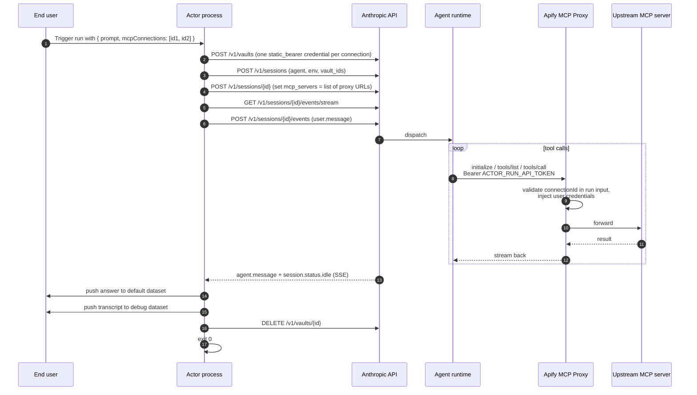

# Plan: thin Actor wrapper for a Claude Managed Agent

## What we're building

A minimal Apify Actor template that lets a developer publish their existing
Claude Managed Agent to the Apify marketplace, with the agent's toolbox wired
to **Apify MCP Connectors** — Slack, Notion, GitHub and any other MCP server
the end user has authorized in their Apify account.

The Actor does one thing: it forwards a prompt to the agent and returns the
answer. The agent talks to the Apify MCP Proxy directly — the Actor is **not**
in the request path for tool calls.

Target size: ~120 LOC. Forking + publishing should take ~5 minutes.

## Why this is simple

The Apify MCP Proxy already handles every hard part:
- Stores user credentials encrypted (OAuth, API keys, PATs).
- Injects credentials into upstream MCP requests at runtime.
- Enforces a per-connection tool ceiling and a per-Actor tool ceiling.
- Validates that the calling Actor run is authorized to use each connection.
- Closes sessions automatically when the Actor run ends.

The Actor template just plugs the Anthropic agent into that machinery via
the agent's `mcp_servers`. No HTTP server in the Actor. No `/mcp` proxy code.

## Architecture

```mermaid
flowchart LR
    User["End user<br/>(Apify Console)"]
    Apify["Apify platform"]
    Actor["Actor process<br/>(orchestrator only)"]
    AnthropicAPI["Anthropic<br/>Managed Agents API"]
    AgentRT["Agent runtime<br/>(Anthropic cloud container)"]
    Proxy["Apify MCP Proxy<br/>APIFY_MCP_PROXY_URL"]
    Up["e.g. Slack / Notion / GitHub"]

    User -- "{ prompt, mcpConnections }" --> Apify
    Apify -- "spawn run<br/>inject ACTOR_RUN_API_TOKEN<br/>+ APIFY_MCP_PROXY_URL" --> Actor
    Actor -- "create vault + session<br/>stream events" --> AnthropicAPI
    AnthropicAPI --> AgentRT
    AgentRT -- "Bearer ACTOR_RUN_API_TOKEN<br/>/connection/<id>" --> Proxy
    Proxy -- "inject user creds" --> Up
    AgentRT -- "agent.message events" --> Actor
    Actor -- "answer + transcript" --> Apify
    Apify -- "result" --> User
```



## Lifecycle (per run)



## Step-by-step (with sources)

### One-time setup (developer)

| # | Action | How |
|---|---|---|
| 0a | Create the Managed Agent on Anthropic side (system prompt, model, skills). `mcp_servers` can be empty. | Anthropic Console or `scripts/provision.ts` |
| 0b | Create one cloud Environment. | `POST /v1/environments` |
| 0c | Set Actor secrets: `ANTHROPIC_API_KEY`, `ANTHROPIC_AGENT_ID`, `ANTHROPIC_ENVIRONMENT_ID`. | Apify Console |
| 0d | `apify push`. | Apify CLI |

### Per run (the Actor process)

| # | Action | API / SDK |
|---|---|---|
| 1 | Read `Actor.getInput()` → `{ prompt, mcpConnections: string[] }`. | Apify SDK |
| 2 | Read `process.env.APIFY_MCP_PROXY_URL` and `process.env.ACTOR_RUN_API_TOKEN`. | Apify runtime env |
| 3 | Create vault. | `POST /v1/vaults` |
| 4 | For each `connectionId` in input, add a `static_bearer` credential: `mcp_server_url = ${APIFY_MCP_PROXY_URL}/connection/${connectionId}`, `token = ACTOR_RUN_API_TOKEN`. | `POST /v1/vaults/{id}/credentials` |
| 5 | Create session, pass `vault_ids = [vault.id]`. Status starts `idle`. | `POST /v1/sessions` |
| 6 | Update session: `agent.mcp_servers = [{ type: "url", name: connectionId, url: "<proxy URL above>" }, …]`, `agent.tools = [{ type: "agent_toolset_20260401" }, { type: "mcp_toolset", mcp_server_name: connectionId }, …]`. | `POST /v1/sessions/{id}` |
| 7 | Open SSE stream **before** sending the prompt (avoids dropped events). Collect events into a transcript as they arrive. | `GET /v1/sessions/{id}/events/stream` |
| 8 | Send `user.message` event with the prompt. | `POST /v1/sessions/{id}/events` |
| 9 | Consume stream until `session.status.idle` or `terminated`. | SSE consumer |
| 10 | Extract text from the most recent `agent.message` event. | (in-stream) |
| 11 | `Actor.pushData({ prompt, answer, sessionId })` → default dataset. Open `Actor.openDataset('debug')` and push the full transcript → debug dataset. | Apify SDK |
| 12 | Delete the vault. | `DELETE /v1/vaults/{id}` |
| 13 | `process.exit(0)`. | — |

There is **no `/mcp` handler** in the Actor. The Anthropic agent talks to the
Apify MCP Proxy directly using the bearer token that the Anthropic vault
injects.

## Input schema

```jsonc
{
  "prompt": {
    "title": "Prompt",
    "type": "string",
    "editor": "textarea",
    "description": "What you want the agent to do."
  },
  "mcpConnections": {
    "title": "MCP connectors",
    "type": "array",
    "resourceType": "mcpConnector",
    "mcpServers": [{ "url": "*" }],
    "description": "Connectors the agent can use. Create them in Settings → API & Integrations.",
    "default": []
  }
}
```

`mcpServers: [{ url: "*" }]` keeps the Actor compatible with any user
connector. A more restrictive Actor (e.g. Slack-only) can narrow this.

## File layout

```
src/
  main.ts          ~80  LOC   input -> vault -> session -> stream -> datasets -> exit
  anthropic.ts     ~60  LOC   thin SDK wrappers (createVault, createSession, updateSession, stream, deleteVault)
scripts/
  provision.ts     ~50  LOC   developer runs once: create agent + environment, print IDs
.actor/
  actor.json
  input_schema.json
README.md           fork-and-push guide
```

## Confirmed decisions

- **Run mode:** Normal (not Standby). One container per run, exits when done.
- **Actor's request-path role:** none. The Anthropic agent talks to Apify MCP
  Proxy directly. The Actor only orchestrates the Anthropic session.
- **Input shape:** `{ prompt, mcpConnections }`. No `additional_instructions`
  field for v1.
- **Output:** two datasets — default (final answer) + `debug` (full transcript).
- **Auth token to the proxy:** `ACTOR_RUN_API_TOKEN`. Expires when the run ends,
  which is the security boundary we want.

## Important things to know

- **`ACTOR_RUN_API_TOKEN` is run-scoped.** It expires with the run. If
  Anthropic's agent tries to call the proxy after the Actor exits, requests
  fail with 401. That's why the Actor must stay alive while the agent runs —
  done naturally by blocking on the SSE stream until `idle`.
- **Proxy validates connection IDs against run input.** If a connector isn't
  in the Actor's input array, the proxy rejects it. The input schema is the
  security perimeter — picking the right `mcpServers` patterns there controls
  what the agent can touch.
- **Tool ceiling.** With `mcpServers: [{ url: "*" }]` we impose no Actor-level
  ceiling. The connection's `allowedTools` and the OAuth scopes still apply.
  A future v2 can expose tighter filters per connector type.
- **Networking on the Anthropic environment.** Default `unrestricted` works.
  With `limited`, the developer needs the MCP Proxy host in `allowed_hosts`
  (e.g. `mcp-proxy.apify.com` — confirm exact host once deployed).
- **`mcp_server_url` must byte-match** between the vault credential (step 4)
  and the session's `mcp_servers` entry (step 6). Construct both from the
  same template string to guarantee.

## What gets deleted from the current code

- `src/server.ts` — in-Actor HTTP gateway (~266 LOC). Gone.
- `src/mcp.ts` — Apify MCP Proxy passthrough (~125 LOC). Gone.
- `cloneAgentWithDynamicMcp` in `src/anthropic.ts` — agent cloning. Gone.
- `waitForSessionIdle` polling loop. Replaced by SSE stream.
- The KV-store environment cache. Environment ID is now a static secret.
- `error` status check at `src/anthropic.ts:289` — documented statuses are
  `idle | running | rescheduling | terminated`.

## Alternatives considered

### A. Actor as MCP host (`/mcp` proxy inside the container)

**How:** Run an HTTP server in the Actor container. Anthropic's agent calls
`<container-url>/mcp/<id>`. Actor forwards to
`${APIFY_MCP_PROXY_URL}/connection/<id>`.

**Why not:** The Apify MCP Proxy already does credential injection, tool
filtering, run-scoped validation, and session cleanup. Putting the Actor in
front duplicates those checks and adds a hop. Easy to add later as opt-in if a
forker needs a custom seam (logging, tool transformation).

### B. Standby mode (Actor as long-running web server)

**How:** Actor stays alive at a stable URL. Agent's `mcp_servers` is baked in
at agent-creation time.

**Why not:** Couples the agent definition to a specific Actor slug. Cold-start
latency is moot (agent runs take seconds-to-minutes anyway). Standby's
strengths (warm, multi-turn) don't help this workload. Can be added later as
opt-in for advanced forkers.

### C. Per-run agent cloning (current code)

**How:** Clone the template agent each run with the run-specific MCP URL.

**Why not:** Extra API calls, orphaned agents on crashes. The docs explicitly
support per-session `mcp_servers` update — which removes the need to clone.

### D. Bootstrap-on-first-run (auto-provision agent at Actor startup)

**How:** Actor checks if `ANTHROPIC_AGENT_ID` is set; if not, creates the
agent + environment and persists IDs in the KV store.

**Why not:** Race conditions on parallel boots, hidden side effects, complex
runtime. A `scripts/provision.ts` the developer runs locally is clearer.

## Risks

1. **Anthropic agent runtime must reach the Apify MCP Proxy host.** Default
   `unrestricted` networking covers it. Document the host name for developers
   using `limited` networking.
2. **The MCP Proxy is V1.** Most major OAuth providers (GitHub, Slack, Google,
   Microsoft) currently need "user-provided OAuth client" setup. Notion + a
   few others work with zero setup via DCR. Worth a section in the README so
   forkers know which connectors are easy/hard to set up.
3. **`mcp_server_url` byte-match** between vault credential and session
   `mcp_servers` (see "Important things to know").
4. **Schema naming convergence.** The user-facing connector doc and the proxy
   internal spec use slightly different field names (`mcpConnector` vs
   `mcpConnection`, `mcpServers` vs `mcp.serverUrls`). We'll follow the
   user-facing doc and update if the names settle differently before launch.

## Sources

- Managed Agents overview — https://platform.claude.com/docs/en/managed-agents/overview
- Sessions (create, update, statuses) — https://platform.claude.com/docs/en/managed-agents/sessions
- Events and streaming (SSE) — https://platform.claude.com/docs/en/managed-agents/events-and-streaming
- Vaults and `static_bearer` — https://platform.claude.com/docs/en/managed-agents/vaults
- Environments — https://platform.claude.com/docs/en/managed-agents/environments
- Apify MCP Connectors (user-facing draft) — provided in conversation context
- Apify MCP Proxy spec — apify/apify-mcp-proxy `docs/mcp-proxy-and-connections.md`
